# *Unlocking Restaurant Revenue: Analyzing Key Strategies for Boosting Profitability*

- [Background](#background)
- [Data exploration and insights discovery](#Data-exploration-and-insights-discovery)
   + [notebook](exploring-data.ipynb)
- [Clustering analysis and segmentation](#Clustering-analysis-and-segmentation)
   + [notebook](clustering-clients.ipynb)
- [Revenue Predictions](#Revenue-Predictions)
   + [notebook](revenue-strategy.ipynb)
- [The Importance of Understanding Machine Learning Predictions](#The-Importance-of-Understanding-Machine-Learning-Predictions)
   + [notebook](Interpreting-ML-Models-Understanding-Key-Features.ipynb)
- [Exploring Hypotheticals to Improve Revenue](#Exploring-Hypotheticals-to-Improve-Revenue)
   + [notebook](Interpreting-ML-Models-Understanding-Key-Features.ipynb)

### *Background*

*The Power of Smart Strategies and Data-Driven Decisions*

In today's highly competitive restaurant industry, maximizing revenue is more crucial than ever. Restaurants need to adopt innovative strategies and make data-driven decisions to stay ahead. 

In this analysis, we explore how smart decision-making, strategic planning, and in-depth analysis can significantly boost restaurant revenue. Leveraging advanced machine learning algorithms and causal inference methods, we can uncover hidden patterns and insights that drive profitability. 

By understanding the importance of effective revenue management, we can implement targeted actions that not only enhance the customer experience but also optimize operational efficiency. Join us as we delve into the transformative potential of combining cutting-edge technology with strategic foresight to elevate your restaurant's financial performance.

### *Data exploration and insights discovery*

To begin implementing the strategy, we first need to delve into the data to gain a better understanding of market behavior. This detailed analysis will provide the insights necessary to tailor our approach effectively.

In the following box chart, it's evident that there are no atypical values. However, what's striking is the minimal expenditure on marketing, coupled with the observation that certain restaurants have a notably low customer count.

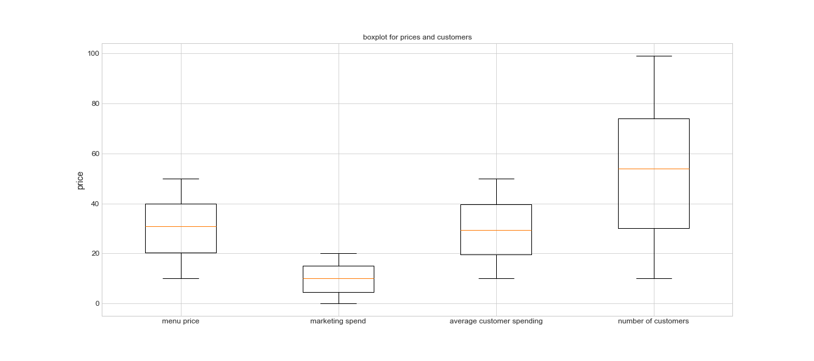

In examining the box charts, we find no atypical data in key metrics such as menu prices, marketing spend, average customer spending, and the number of customers. However, a closer look reveals some outliers in monthly revenue, with notably high values that appear somewhat abnormal. To gain a clearer understanding of this anomaly, further exploration of the data is necessary. 

Additionally, the presence of negative revenue figures raises concerns, suggesting instances where costs surpass income—a scenario that warrants investigation. One plausible hypothesis is that the restaurant is new and thus invests heavily in marketing, anticipating a surge in clientele.

Turning to specific features:

Menu prices predominantly fall within the range of 20 to 40 dollars, though the influence of cuisine type remains undetermined.
Marketing expenditure appears disproportionately low compared to menu prices, with no restaurant exceeding a 20-dollar spend.
Average customer spending mirrors menu prices without notable anomalies, alongside a stable customer count. However, deeper analysis is required to assess the impact of promotions on these metrics and ascertain whether promotions correlate with revenue growth or increased customer visits.

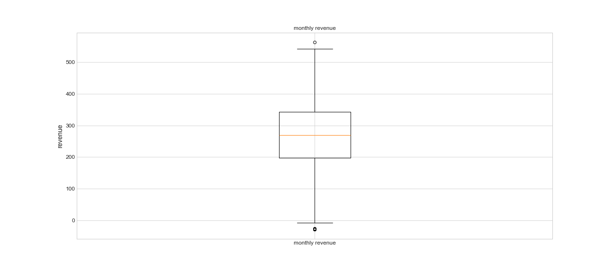

Now, considering our initial exploration into the relationship among income, revenue, and pricing, it becomes evident that a positive correlation exists. In other words, when there's an uptick in marketing expenditure and menu prices, revenue tends to rise accordingly.

While this association isn't overwhelmingly strong, it provides valuable insights. Firstly, we discern that menu pricing doesn't significantly sway sales. Instead, our focus shifts to analyzing customer numbers and average spending per customer. By first determining **elasticity** and subsequently assessing the influence of the average transaction value on revenue, we gain a deeper understanding of their impacts.

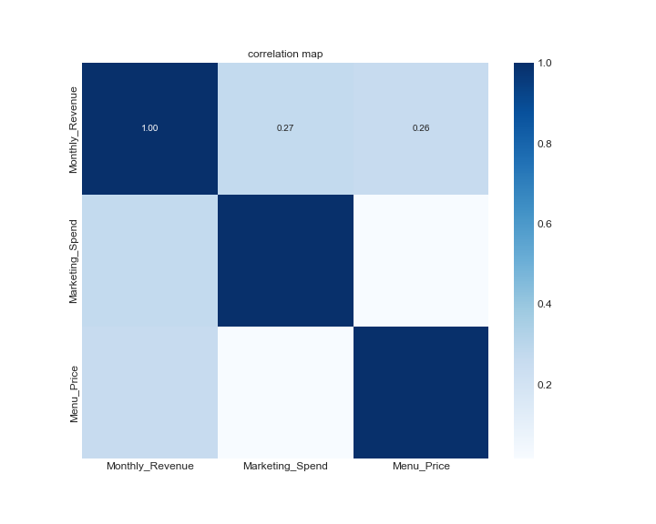

`marketing efficency`

Moving forward, a crucial step involves calculating the marketing ROI. A high ROI indicates that you're generating substantial income for every dollar invested in marketing, showcasing the efficiency of your marketing expenditure. On the other hand, a low ROI suggests the need to refine your strategy and optimize your marketing spend to enhance efficiency and maximize returns.

As we analyze the revenue data, we notice some outliers that can obscure the overall understanding of ROI across all restaurants. To gain deeper insights into the business, we will conduct further analysis to navigate beyond these anomalies.

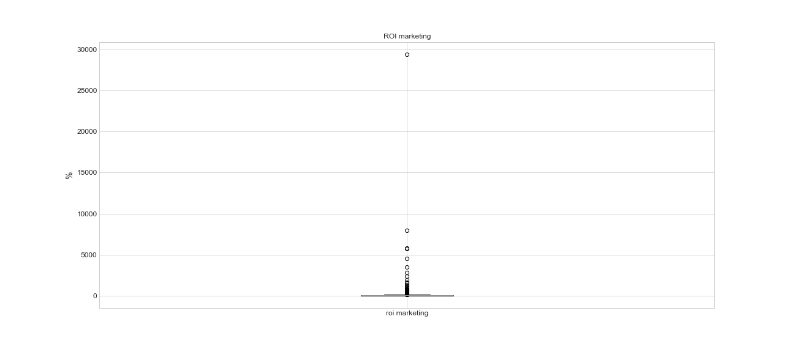

As depicted in the chart below, Japanese cuisine stands out with the highest revenue. This suggests that perhaps the average menu price for Japanese dishes is also the highest among all cuisine types. Moreover, it's plausible that this particular cuisine type is responsible for the outlier points in the ROI analysis.

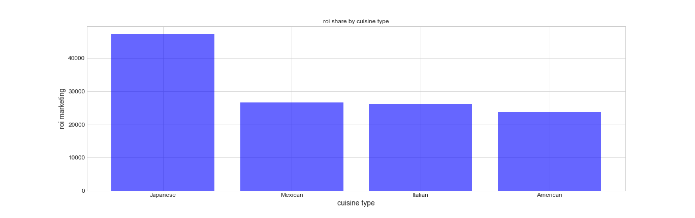

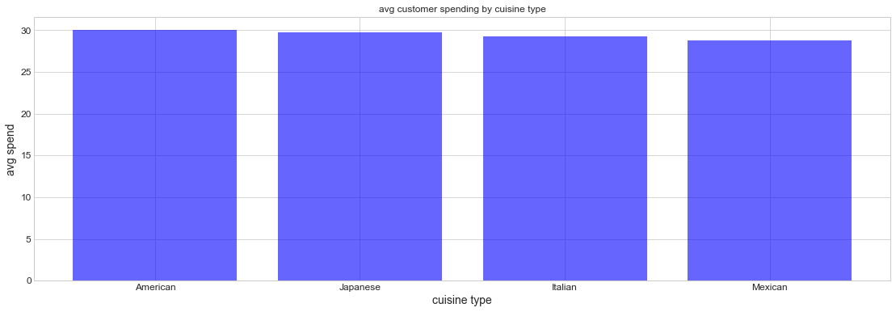

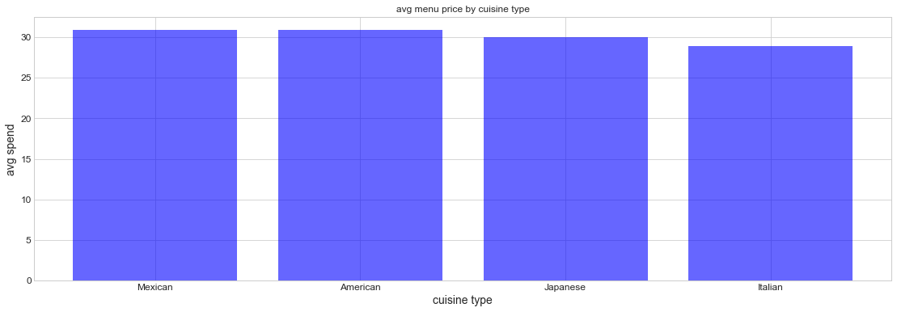

The reality diverges significantly from our earlier assumption that Japanese cuisine commands a higher average menu price. Upon closer examination, it becomes evident that the average customer spending across all cuisine types remains fairly consistent. Surprisingly, the menu prices for Japanese dishes are comparatively lower than those for Mexican cuisine, which appears to be priced at a premium. This unexpected finding prompts a deeper investigation to understand the underlying reasons for this particular behavior.

`promotion impact`

In our quest to understand the impact of promotions on customer visits, the violin chart provides valuable insights. Comparing the median points, we observe that when promotions are applied, there's a notable increase in customer numbers compared to periods without promotions. Additionally, the dispersion of customers appears to be more concentrated during promotional periods. This suggests a potential link between promotions and customer turnout, although it's premature to establish causality at this stage. It's important to note that other external factors not captured in the dataset, such as day of the week, holidays, and weather conditions, may also influence customer traffic and warrant consideration in our analysis.

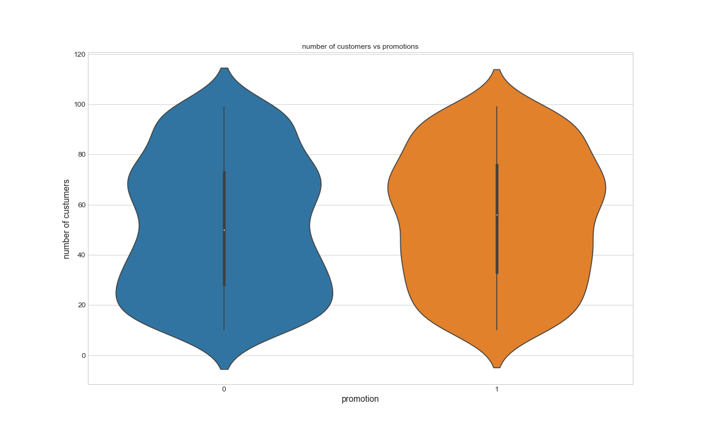

`price impact`

The chart below presents a nuanced view of Japanese cuisine within the market. While it does not feature the most expensive menu or the highest average customer spending, it boasts the highest marketing ROI. However, it's important to note that there is an outlier in the data, urging caution in our conclusions. To formulate the best strategy moving forward, we must delve deeper into the data to understand the preferences and behaviors of different customer segments. Additionally, a comprehensive overview that includes revenue metrics will be essential in aligning our marketing efforts with the broader business objectives. This thorough analysis will ensure that our strategies are both informed and effective.

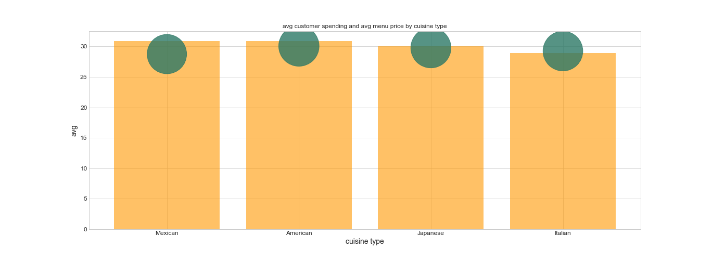

The latest chart offers valuable insights into the visitor counts at our establishments, with Japanese food restaurants seeing a notable increase in patronage. This trend may be influenced by a variety of factors, such as prime locations, compelling promotions, or substantial marketing investments. Additionally, there are indications that **pricing strategies** are also impacting customer attendance. Understanding these dynamics is crucial for optimizing our approach to attract and retain more customers efficiently.

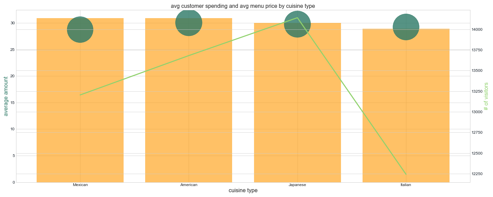

`Relation among the revenue, the number of visitors and reviews`

The radar chart provides some intriguing insights into our culinary offerings. Consistent with previous data, Japanese cuisine generates the highest average monthly revenue, although the figures are quite similar across all types of cuisines. Interestingly, Mexican food, despite not garnering a large number of reviews, maintains a robust visitor count. On the other hand, Italian cuisine, which has slightly more reviews than Mexican, surprisingly sees fewer customers, even with comparable menu prices. This suggests that other variables such as promotions, location, or service quality might be influencing these trends. Currently, we can only speculate whether promotions directly affect customer turnout. In the upcoming sections, we will engage in causal inference analysis to determine the impact of these factors more definitively.

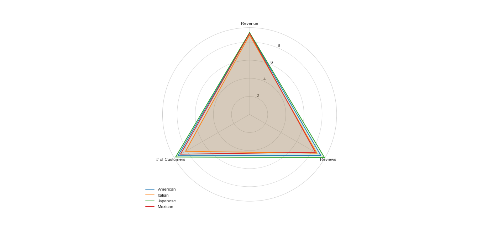

<!-- #region -->
### `Insights`

*Distribution Data Analysis:*
- The charts reveal mostly typical values across various features with notable exceptions in the revenue data. Japanese cuisine displays extreme revenue values, including some restaurants experiencing negative revenue, indicating financial losses. Conversely, most menu prices and average customer spending lie within the \\$20 to \\$40 range, with minimal marketing expenditure across all establishments.

*Revenue Correlation Insights:*
- Analysis indicates a positive correlation between revenue and both marketing spend and menu price. This suggests that higher menu prices and increased marketing investments may lead to an uptick in revenue, although the correlations are modest and not necessarily indicative of causation.

*Marketing ROI and Cuisine Type:*
- Japanese cuisine consistently shows the highest marketing ROI, possibly skewed by outliers. This suggests that Japanese restaurants may be more effective in managing marketing efforts like promotions. However, this does not imply causality. Notably, the Japanese menu is not the priciest, nor does it attract the highest spending per customer.

*Impact of Promotions:*
- Violin chart analysis demonstrates that promotions significantly impact customer numbers, with a noticeable uptick in visitors during promotional periods. This could suggest a market responsive to price changes (elastic market), although it remains speculative without more detailed information.

*Price Versus Customer Numbers:*
- There appears to be no direct correlation between menu prices and customer volume. For instance, despite having lower menu prices, Italian cuisine does not attract more customers compared to American cuisine, which has higher prices and more visitors. Location may play a role in this dynamic, but this remains an assumption.

*Radar Chart and Customer Insights:*
- The radar chart highlights an interesting trend: despite Italian cuisine receiving slightly more reviews than Mexican cuisine, the latter maintains a higher customer count, possibly due to effective promotional strategies.

**Current Insights:**
- Reviews do not necessarily translate to increased visitor numbers.
- Japanese cuisine sites exhibit the best performance in terms of ROI.
- Menu pricing appears to have a minimal impact on demand, suggesting market inelasticity.
- Promotions significantly influence customer numbers, enhancing restaurant visitation despite low marketing expenditure.

These observations underscore the complex interplay of factors affecting restaurant performance and customer behavior.
<!-- #endregion -->

<!-- #region -->
### *Clustering analysis and segmentation*

In our previous analysis, we identified numerous factors influencing the revenue of a site. These factors highlight the diverse behaviors of consumers, making it clear that a one-size-fits-all approach is insufficient for understanding and optimizing consumer interactions.

To address this challenge effectively, it is essential to segment consumers into different classes. By clustering consumers based on their behavior and characteristics, we can gain deeper insights into their preferences, needs, and purchasing patterns. This segmentation allows for more targeted and personalized strategies, ultimately enhancing revenue optimization.

#### `Why Clustering is Crucial`

Clustering helps in distinguishing between different consumer segments, enabling businesses to tailor their marketing efforts, product offerings, and customer service to meet the specific needs of each group. Here are some key benefits of clustering consumers:

- **Personalized Marketing:** Understanding the unique characteristics of each cluster allows for the creation of personalized marketing campaigns that resonate more with the target audience.

- **Improved Customer Experience:** By recognizing the distinct needs and preferences of each segment, businesses can enhance the overall customer experience, leading to increased satisfaction and loyalty.

- **Efficient Resource Allocation:** Clustering enables better allocation of resources by identifying high-value customer segments that may require more attention and investment.

- **Enhanced Product Development:** Insights from different consumer segments can inform product development, ensuring that new offerings meet the actual demands of various consumer groups.

*Preprocessing:*
Before proceeding with clustering, we need to scale the data. This step is crucial because it ensures that all features contribute equally to the results. Here's why:

- Equal Weight: Features in our data may have different units and ranges. Without scaling, features with larger values can dominate the clustering process, skewing the results.

- Improved Accuracy: Scaling standardizes the data, typically giving each feature a mean of 0 and a standard deviation of 1. This allows clustering algorithms like K-means to accurately identify patterns and group similar data points.

- Distance Calculation: Clustering algorithms often use distance measures, such as Euclidean distance, to determine similarity between data points. Scaling ensures that no single feature disproportionately influences these distances.

#### `Decoding Clustering Metrics: Understanding Our Initial Results`

In our first attempt to cluster consumer data using the K-means algorithm, we divided the data into five clusters. The resulting metrics provide valuable insights into the effectiveness of our clustering approach. Let's break down the results:

**Results Summary**
- K-means Inertia: 5521.6754
- Silhouette Score: 0.1076
- Davies-Bouldin Score: 2.2603
- Calinski-Harabasz Score: 111.6478

**Understanding the Metrics**

- **K-means Inertia:** This metric measures the sum of squared distances between each point and the centroid of its assigned cluster. A lower inertia indicates tighter clusters. In our case, an inertia of 5521.6754 suggests that there is some level of compactness within our clusters, but this value alone isn't enough to determine the quality of clustering.

- **Silhouette Score:** This score ranges from -1 to 1 and evaluates how similar each point is to its own cluster compared to other clusters. A higher score indicates well-defined clusters. Our score of 0.1076 is relatively low, implying that the clusters might overlap or not be distinctly separated.

- **Davies-Bouldin Score:** This index measures the average similarity ratio of each cluster with the one that is most similar to it. Lower values indicate better clustering. Our score of 2.2603 suggests moderate separation between clusters, but there is room for improvement.

- **Calinski-Harabasz Score:** Also known as the Variance Ratio Criterion, this score evaluates the ratio of the sum of between-cluster dispersion and within-cluster dispersion. Higher values indicate better-defined clusters. A score of 111.6478 suggests that there is a reasonable amount of separation and compactness within our clusters.

**What Do These Results Mean?**  
The initial metrics provide a mixed picture of our clustering performance. While the inertia value shows some degree of compactness, the low Silhouette Score indicates that the clusters are not well-separated. The Davies-Bouldin Score and Calinski-Harabasz Score offer a more positive outlook but also suggest areas for improvement.
<!-- #endregion -->

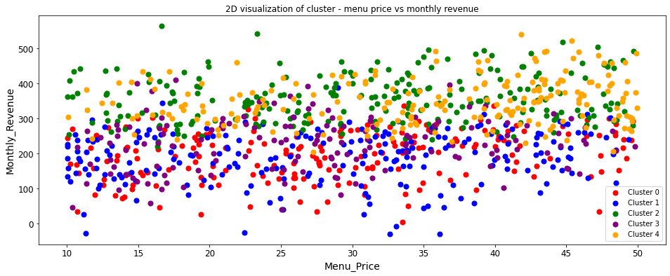

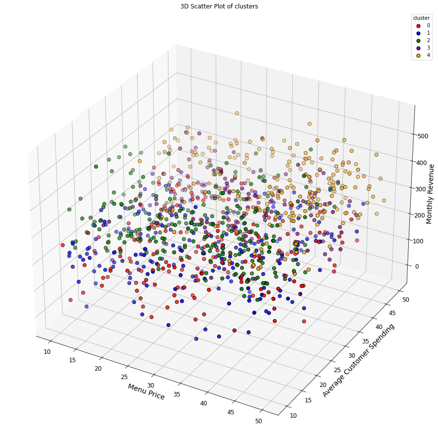

#### `Enhancing Our Clustering Algorithm with New Variables`

To improve the performance of our clustering algorithm, we plan to incorporate additional variables that provide deeper insights into consumer behavior and business performance. These new variables are:
- Customer Spending Ratio
- Customer Profitability
- Review-to-Revenue Conversion Ratio
- Spend Efficiency
- Menu Price Ratio

After incorporating the new variables into our clustering algorithm, we observed notable changes in the results.  

**Summary of the updated metrics:**
- K-means Inertia: 10108.3255
- Silhouette Score: 0.1403
- Davies-Bouldin Score: 2.0673
- Calinski-Harabasz Score: 142.6085

**Interpreting the New Results**

**K-means Inertia:** The inertia value increased to 10108.3255. This increase is expected when adding new variables, as the overall dataset's complexity and dimensionality grow. However, it also means that the clusters might be more spread out, reflecting a richer and more nuanced data structure.

**Silhouette Score:** The silhouette score improved to 0.1403 from 0.1076. While still relatively low, this increase indicates that the clusters are slightly better defined and more distinguishable from each other.

**Davies-Bouldin Score:** The Davies-Bouldin score decreased to 2.0673, which is a positive sign. Lower values indicate better clustering, as there is less similarity between clusters, suggesting improved separation and compactness.

**Calinski-Harabasz Score:** The Calinski-Harabasz score increased to 142.6085, indicating better-defined clusters with a higher ratio of between-cluster dispersion to within-cluster dispersion.

**Choosing the Optimal Number of Clusters**

While five clusters offer the most granularity and accuracy, the complexity of implementing and managing this many clusters can be challenging. Therefore, we opted for three clusters, balancing simplicity with the need for meaningful insights. This approach allows us to maintain a good understanding of consumer behavior without overcomplicating the segmentation process.

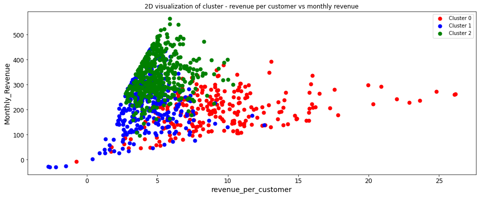

**`Segmentation of Restaurant Clientele: Insights from Data Analysis`**

Based on the analysis of our information, results and the observed behavior of restaurant customers, we can categorize the clientele into three distinct segments:

- *Cluster 0:* Standard Clients 
- *Cluster 1:* Economic Clients 
- *Cluster 2:* Premium Clients 

**Key Findings** 

Our findings reveal that the most profitable clients belong to the premium segment, followed by the economic segment. Interestingly, despite having lower average menu prices, the economic clients generate higher monthly revenue on average compared to the standard clients.

**Understanding the Phenomenon**

This revenue pattern can be attributed to several factors:

- *Standard Clients:* These clients tend to choose more expensive menu items but visit the restaurants less frequently. Their higher spending per visit does not compensate for the lower visit frequency, resulting in comparatively lower overall revenue.

- *Economic Clients:* Despite opting for cheaper menu items, these clients frequent the restaurants more often. The higher footfall leads to greater overall revenue, even though the individual spending is lower.

- *Premium Clients:* This segment includes customers who spend significantly on high-end menu items and also have a relatively higher visit frequency. They represent the most profitable segment for the restaurants.

**Implications for Business Strategy**

Understanding these segments allows restaurants to tailor their strategies effectively:

- *Marketing and Promotions:*
  - Standard Clients: Encourage more frequent visits through loyalty programs and targeted promotions that highlight new or exclusive offerings.
  - Economic Clients: Maintain the attraction by offering value deals and emphasizing the affordability of the menu.
  - Premium Clients: Focus on premium experiences, exclusive events, and personalized services to enhance loyalty and spending.

- *Menu Design:*
  - Standard Clients: Introduce mid-range items that could appeal to this group, encouraging them to visit more often.
  - Economic Clients: Keep a diverse range of affordable options to retain this high-frequency segment.
  - Premium Clients: Continuously innovate with high-end dishes and unique dining experiences.

- *Customer Experience:*
  - Standard Clients: Improve the overall dining experience to encourage repeat visits, such as through improved service or ambiance.
  - Economic Clients: Ensure quick and efficient service to handle the higher volume of customers.
  - Premium Clients: Provide exceptional and personalized customer service to justify the higher prices and enhance satisfaction.

### *Revenue Predictions*

The next step in our revenue strategy is to pinpoint the key features that differentiate more profitable locations from less profitable ones. Since revenue is a crucial metric in our context, our goal is to simplify the prediction of site behavior by categorizing locations into three types: low, medium, and high revenue.

**Categorizing Revenue**

To streamline our analysis and predictions, we classify locations based on their monthly revenue into three distinct categories:

- Low Revenue
- Medium Revenue
- High Revenue

**Analyzing Revenue Data**

As illustrated in the following chart, we notice some atypical values. These outliers represent locations with unusually high or low revenue compared to the average. While these values are noteworthy, we anticipate that they will not significantly skew our overall analysis.

**Visualizing Revenue Distribution: Insights from the Sankey Chart**

In the Sankey chart below, we observe that a significant proportion of the sites fall into the medium revenue category, while a smaller proportion are classified as high revenue sites. This visualization provides a clear understanding of our site's revenue distribution and allows us to move forward with confidence, having effectively categorized our sites into three distinct revenue buckets.

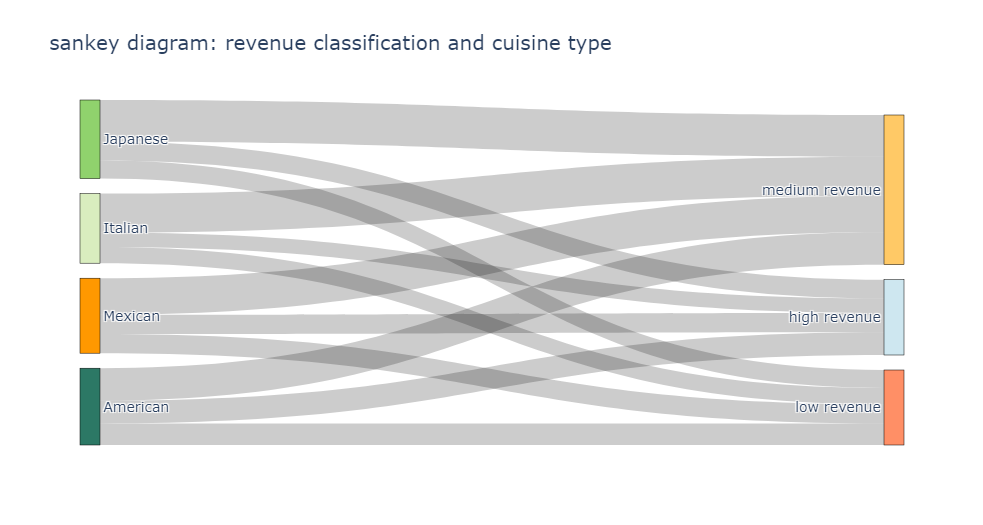

**The Importance of Data Preprocessing in Machine Learning**

Data preprocessing is a crucial step before feeding data into a machine learning algorithm. It enhances the algorithm's ability to learn from the data and generalize its findings, significantly improving performance and training speed. Proper preprocessing involves normalizing the range of independent variables, handling missing values, removing noise, and converting data into a suitable format for analysis. This ensures that the data is clean, well-structured, and ready for accurate and reliable predictions.

*Our Preprocessing Approach*

Currently, we are employing a strategy to handle potential missing values, even though initial exploration indicated no missing values. By incorporating median imputation into our preprocessing, we ensure consistency and robustness in our data preparation.

- *Median Imputation:* We use median imputation to handle any missing values. This method replaces missing values with the median of the respective feature. It is robust to outliers and ensures that our data remains consistent, enhancing the reliability of our analysis.

*The Role of Scaling*

In addition to handling missing values, scaling the data is a critical preprocessing step. While we have not yet implemented scaling, it is essential for ensuring that all features contribute equally to the model's learning process.

- *Standard Scaling:* The primary goal of scaling is to ensure that all features are within the same dimension. Features with varying scales can make it challenging for the algorithm to identify patterns. Standard scaling normalizes the range of independent variables, enhancing the performance and training speed of the model.

**The Importance of Establishing a Baseline in Data Science Projects**

Having a baseline in a data science project is crucial because it serves as a reference point to measure the performance of your models. Here’s a clear and simple explanation:

*`Key Benefits of a Baseline`*

1. **Performance Comparison**: A baseline provides a standard against which you can compare your models. If your model performs better than the baseline, it indicates that your model is adding value. If not, it suggests that improvements are needed.

2. **Understanding Improvements**: By comparing your model to the baseline, you can easily gauge how much improvement you’ve made. This helps quantify the progress and effectiveness of your model.

3. **Identifying Issues**: If your model doesn't outperform the baseline, it may indicate issues with your data, model, or approach. This early detection helps you identify and address problems in the development process.

4. **Simplicity**: A baseline is usually simple and easy to implement. For example, it can be as straightforward as predicting the most frequent class in a classification problem or the mean value in a regression problem. This simplicity makes it a useful tool for initial evaluations.

*`Avoiding Data Leakage: Excluding "Monthly Revenue" from Our Prediction Model`*

In our data science project, it is crucial to avoid including the variable "Monthly Revenue" in our prediction model. While we use "Monthly Revenue" to define our revenue classification, incorporating it into the prediction model would introduce a proxy variable, leading to data leakage and compromising the integrity of our model.

**Baseline**

In the realm of machine learning, establishing a baseline model is essential for measuring improvement and guiding further refinement. In our current case study, we started with a decision tree classifier, experimenting with various hyperparameters such as maximum depth and minimum samples to split. Using a grid search approach, we aimed to identify the optimal hyperparameters for the best predictive performance.

*`Model Development and Evaluation`*

*`Data Splitting`*

The dataset was divided into training and testing sets in an 80-20 split. This ensures a robust evaluation of the model's performance on unseen data, providing a reliable measure of its predictive power.

*`Hyperparameter Tuning`*

We fine-tuned our decision tree model by adjusting hyperparameters, ultimately achieving an accuracy of 83%. This performance metric indicates the model's effectiveness in predicting the revenue categories of the sites.

*`Confusion Matrix`*

To gain deeper insights into the model's classification performance, we examined the confusion matrix:

|                      | **Predicted: High Revenue** | **Predicted: Low Revenue** | **Predicted: Medium Revenue** |
|----------------------|-----------------------------|----------------------------|-------------------------------|
| **Actual: High Revenue**   | 36                          | 0                          | 10                            |
| **Actual: Low Revenue**    | 0                           | 41                         | 16                            |
| **Actual: Medium Revenue** | 5                           | 3                          | 89                            |

*`Interpretation of Results`*

The confusion matrix illustrates the predictive performance of our decision tree model across different revenue categories:

- **High Revenue Sites**: The model correctly identified 36 out of 46 high revenue sites but misclassified 10 as medium revenue sites.
- **Low Revenue Sites**: The model accurately predicted 41 low revenue sites, though it misclassified 16 as medium revenue sites.
- **Medium Revenue Sites**: The model excelled in predicting medium revenue sites, correctly classifying 89 out of 97 cases, but misclassified 5 as high revenue and 3 as low revenue sites.

*`Key Insights`*

- *Medium Revenue Sites*: The high accuracy in predicting medium revenue sites suggests that the dataset contains a higher proportion of these cases, making it easier for the model to learn and generalize this category.
- *Low Revenue Sites*: The model's performance is less accurate for low revenue sites, with a notable number of misclassifications as medium revenue sites. This could be due to similarities in features between low and medium revenue sites, indicating a need for further feature engineering or more sophisticated modeling techniques.

**Decision Tree Insights**

In our decision tree model, the plot below highlights the first feature considered: the number of clients, followed by marketing spending. These two features are crucial for understanding how to enhance site revenue. By focusing on these key factors, we can develop targeted strategies that have the most significant impact on revenue growth.

`Key Features Identified`

- *Number of Clients:* This feature is the primary factor in our decision tree, indicating its significant influence on revenue. More clients generally lead to higher revenue, making it essential to focus on strategies that attract and retain customers.

- *Marketing Spending:* The second crucial feature is marketing spending. Effective marketing campaigns can drive customer acquisition and retention, directly impacting the number of clients and, consequently, revenue.

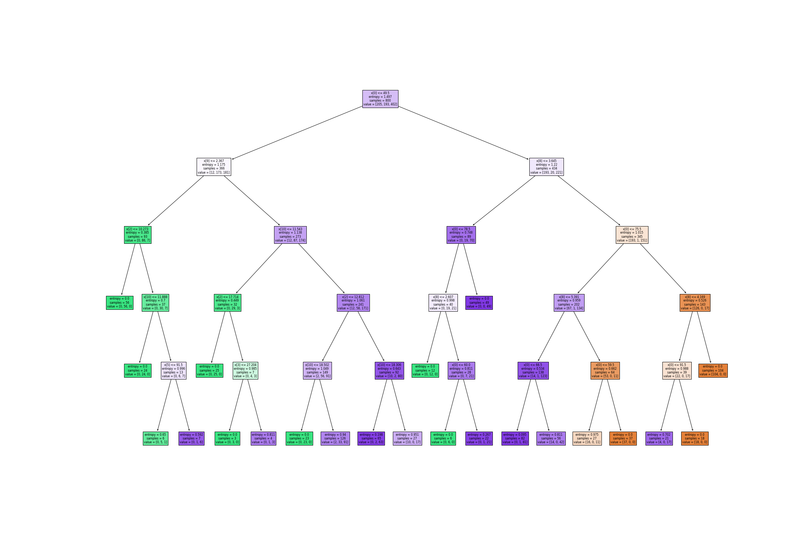

**Revenue Predictions with Machine Learning Models**

The next step in our analysis is to improve upon our baseline model by experimenting with various advanced algorithms. In our case, we explored the following models:

*`Models Explored`*

- *Random Forest*: A versatile and robust model that builds multiple decision trees and merges their results for better accuracy and stability. It helps in capturing the complex relationships within the data.

- *Support Vector Machine (SVM)*: An effective model for high-dimensional spaces that finds the optimal hyperplane for classification. It is particularly useful when the classes are not linearly separable.

- *Bagging Classifier*: This model uses the bagging methodology with decision trees to reduce variance and improve accuracy. By training multiple models on different subsets of the data, it enhances overall performance.

- *AdaBoost*: Based on the boosting methodology, this model combines multiple weak classifiers, such as decision trees, to form a strong classifier. It focuses on improving the predictions of misclassified instances in each iteration.

*`Hyperparameter Tuning with Grid Search`*

As with our baseline model, we employed a grid search approach to fine-tune the hyperparameters of each model. This systematic method allows us to explore a range of parameter values and select the combination that maximizes model performance.

*`Evaluating the Models`*

From our results, it is evident that the AdaBoost classifier is the top-performing model, achieving an accuracy of 0.88. However, a deeper dive into the confusion matrix reveals a more nuanced performance. While the AdaBoost model excels at predicting high-revenue sites, the Random Forest model slightly outperforms it in predicting low-revenue sites and performs comparably for medium-revenue sites.

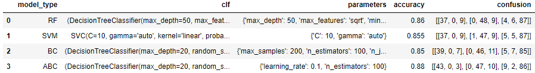

*`Model Performance Comparison`*

*AdaBoost Classifier*
- Accuracy: 0.88
- Strength: Excels at predicting high-revenue sites.
- Weakness: Slightly less effective at predicting low-revenue sites compared to Random Forest.

*Random Forest*
- Strength: Better performance in predicting low-revenue sites.
- Weakness: Slightly less accurate for high-revenue sites but performs well overall.

*`Contextual Model Selection`*

Given these insights, the choice of model should be tailored to the specific context and the implications of incorrect predictions. For instance:

- High-Revenue Focus: If the primary goal is to identify high-revenue sites accurately, AdaBoost is the preferred model.
- Low-Revenue Focus: If misclassifying low-revenue sites has significant implications, Random Forest might be the better choice.
- Balanced Approach: For a balanced approach, considering both high and low-revenue predictions, a combination of models or an ensemble approach could be employed.

*`Profitability Insights`*

It is crucial to note that classification was based on the revenue of each site. Interestingly, on average, low-revenue clients are more profitable than medium-revenue clients. This insight emphasizes the importance of accurately predicting low-revenue sites to maximize profitability.

<!-- #region -->
### The Importance of Understanding Machine Learning Predictions

Understanding how a machine learning algorithm makes predictions is crucial for several reasons:

*Key Reasons for Understanding Model Predictions*

1. **Transparency and Trust**: Knowing the decision-making process helps build trust in the model. When we understand how the algorithm arrives at its conclusions, we can have more confidence in its predictions.

2. **Improving Models**: By understanding the factors that influence the model's decisions, we can make informed adjustments to improve its performance. This could involve tweaking the algorithm, adjusting the data, or refining the features used.

3. **Identifying Bias**: Insight into the prediction process allows us to detect and address any biases in the model. This ensures that the algorithm makes fair and unbiased decisions.

4. **Compliance**: In many industries, there are regulations that require explanations for automated decisions. Understanding how predictions are made helps meet these legal and ethical standards.

5. **Debugging and Maintenance**: When the model's predictions are clear, it’s easier to identify and fix errors or unexpected behavior, ensuring the model continues to perform well over time.

**Using SHAP for Model Explanation**

For our current process, we'll use SHAP (SHapley Additive exPlanations), an algorithm designed to explain the predictions made by machine learning models. Here’s an easy explanation of how SHAP works:

*`How SHAP Works`*

1. **Breaks Down Predictions**: SHAP explains the prediction of a model by breaking it down into contributions from each feature (input variable). It tells us how much each feature contributed to the final prediction.

2. **Fair Distribution**: It’s based on the concept of Shapley values from cooperative game theory, which fairly distributes the “payout” (prediction) among all features, considering all possible combinations of features. This ensures a balanced and fair explanation.

3. **Consistent**: SHAP provides consistent and reliable explanations, meaning similar contributions from features will always result in similar Shapley values, making it easier to interpret the results.

4. **Visual and Intuitive**: SHAP values can be visualized in plots, making it intuitive to see which features are driving the predictions and how they are doing so. This helps in understanding the model’s behavior and making it more transparent.

**Explaining Predictions: Insights from Our Baseline Model**

To better understand how our baseline model makes predictions, we first need to explain its decision-making process. Using SHAP, we can break down the model's predictions and identify the most critical factors driving its decisions.

*`Key Factors Influencing Predictions`*

- **Number of Customers**: Across all revenue classes, the number of customers is the most critical factor. This indicates that the sheer volume of customers significantly impacts the revenue potential of a site.

- **Revenue per Customer**: For high and medium revenue sites, the revenue generated per customer is particularly important. This suggests that not only the number of customers but also the spending behavior of each customer is crucial for higher revenue.

- **Customer Reviews**: In contrast, for low revenue sites, customer reviews play a significant role. Positive reviews can attract more customers, while negative reviews can deter potential customers, impacting the site's revenue.

- **Marketing Spend**: A consistent factor across all revenue classes is marketing spend. This highlights the significant impact of marketing efforts on site revenue, regardless of the revenue class.

*`Implications for Strategy Development`*

By focusing on these key factors—number of customers, revenue per customer, customer reviews, and marketing spend—we can develop more targeted and effective strategies to enhance revenue across different segments. Understanding these drivers enables us to prioritize actions that will yield the highest returns and ensure sustainable growth.

**Insights from the AdaBoost Model**

Having identified the most important features for our baseline model, we now turn our attention to the best-performing model in our case, which is the AdaBoost algorithm. While we observed some improvements in specific classes with the Random Forest model, overall performance, including the confusion matrix, indicates that AdaBoost is superior.

*`Understanding AdaBoost's Predictions with SHAP`*

To gain a deeper understanding of AdaBoost's predictions, we need to delve into SHAP (SHapley Additive exPlanations). SHAP will help us identify the most critical variables influencing the prediction of each class. This understanding will allow us to refine our model and enhance its accuracy, ensuring we leverage the most impactful features for optimal predictive performance.

*`Key Factors Influencing AdaBoost's Predictions`*

Using SHAP, we can break down the AdaBoost model's predictions and identify the key factors for each revenue class. Here's a summary of the most critical variables:

1. **Number of Customers**: Consistently, the number of customers remains the most influential factor across all revenue classes. This underscores the importance of customer volume in driving revenue.

2. **Marketing Spend**: Marketing spend is a significant factor across all classes, highlighting the impact of promotional efforts on revenue generation.

3. **Revenue per Customer**: For high and medium revenue sites, revenue per customer is a critical factor. This suggests that maximizing customer spending is essential for higher revenue classes.

4. **Customer Reviews**: Particularly for low revenue sites, customer reviews play a vital role. Positive reviews can enhance customer trust and attract more clients, thereby increasing revenue.

**Detailed Analysis Using SHAP Values**

*`SHAP Summary Plot`*
<!-- #endregion -->

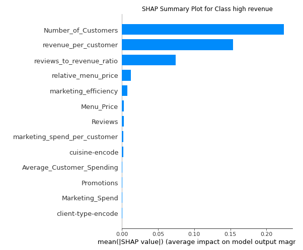

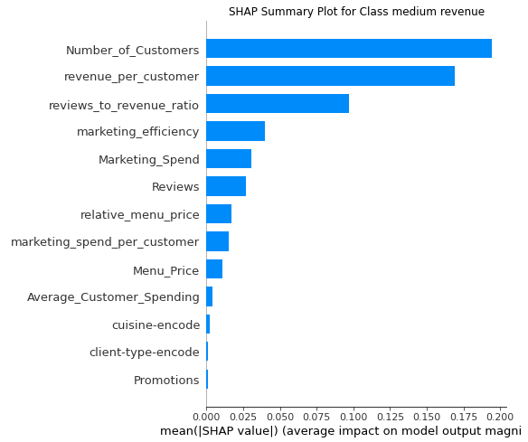

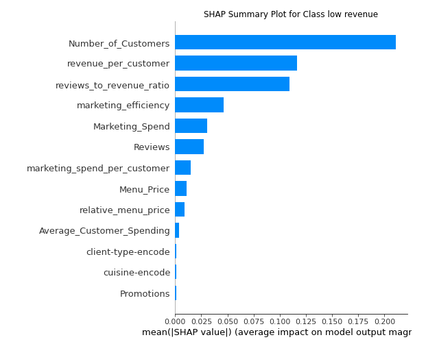

The SHAP summary plot visually represents the impact of each feature on the model's predictions. The plot shows the distribution of SHAP values for each feature, indicating how much each feature contributes to the prediction. Features with larger absolute SHAP values have a greater influence on the model's output.

**Overview Strategy to Increase Revenue: Insights from SHAP Analysis**

Leveraging the insights from our SHAP analysis of the AdaBoost model, we can develop a comprehensive strategy to increase revenue across our sites. By focusing on the most critical factors identified—number of customers, marketing spend, revenue per customer, and customer reviews—we can implement targeted actions that drive significant revenue growth.

*`Key Factors Influencing Revenue`*

- **Number of Customers**
- **Marketing Spend**
- **Revenue per Customer**
- **Customer Reviews**

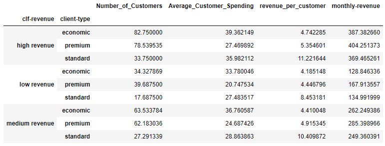

**Overview Strategy**

*`High Revenue Sites`*

The table shows that the average customer spending and the number of clients are lower for premium clients than for economic clients, but the revenue per customer is higher for the premium segment. Interestingly, standard clients have the highest revenue per customer among the high revenue sites.

*Strategies:*

- Increase the Number of Visits to Sites with Standard Clients:
  - Targeted Promotions: Implement targeted promotions and loyalty programs to encourage repeat visits from standard clients.
  - Enhanced Customer Experience: Improve the overall customer experience to increase satisfaction and encourage more frequent visits.

- Increase the Revenue per Customer for Sites with Economic Clients:
  - Upselling and Cross-Selling: Introduce upselling and cross-selling techniques to increase the average spend per visit.
  - Premium Offerings: Introduce premium offerings or exclusive menu items that appeal to economic clients willing to spend more.
  
*`Medium Revenue Sites`*

For medium revenue sites, economic clients spend more on average, but the revenue is slightly higher for premium clients. Although there are more economic clients, similar strategies can be applied.

*Strategies:*

- Increase the Number of Clients Without Decreasing Revenue or Prices:
  - Referral Programs: Implement referral programs to encourage existing clients to bring in new customers.
  - Community Engagement: Engage with the local community through events or partnerships to attract new customers.

- Increase Prices Without Decreasing the Number of Customers:
  - Incremental Price Increases: Gradually increase prices to avoid customer pushback.
  - Enhanced Offerings: Introduce new, high-value items or experiences that justify a higher price point.
  
*`Low Revenue Sites`* 

For low revenue sites, the SHAP values highlighted the importance of the number of customers and the revenue per customer. Both these metrics are lower compared to other clusters.

*Strategies:*

- Increase the Number of Customers:
  - Customer Acquisition Campaigns: Develop targeted marketing campaigns to attract new customers.
  - Partnerships and Collaborations: Collaborate with local businesses or influencers to reach a broader audience.

- Increase the Menu Price:
  - Price Optimization: Carefully analyze price sensitivity to adjust menu prices without losing customers.
  - Value Proposition: Enhance the perceived value of offerings to justify higher prices, such as improving food quality or service.

### Exploring Hypotheticals to Improve Revenue

**Addressing the Key Question: What Adjustments Do We Need to Make to Improve Revenue?**

While SHAP provides valuable insights into the most important features influencing our model's predictions, we need a clear strategy to improve revenue. This involves understanding which features to adjust and by what proportion. This is where DiCE (Diverse Counterfactual Explanations) comes into play.

**What is DiCE?**

DiCE (Diverse Counterfactual Explanations) is an algorithm that helps explain machine learning model predictions by showing alternative scenarios. Here’s a straightforward explanation:

- **What-If Scenarios**: DiCE creates "what-if" scenarios by tweaking the input features slightly to see how these changes affect the prediction. This helps us understand what needs to change for a different outcome.

- **Diverse Explanations**: Instead of providing just one alternative, DiCE offers multiple diverse counterfactual explanations. This shows various ways to achieve a different prediction, giving a broader understanding of the model's behavior.

- **Actionable Insights**: These counterfactual explanations can suggest actionable changes. For example, if a loan application is denied, DiCE might show what changes (like increasing income or reducing debt) could lead to approval.

- **Model Transparency**: By showing how different inputs lead to different outputs, DiCE makes the model's decision-making process more transparent and easier to trust.

*`Applying DiCE to Improve Revenue`*

To formulate targeted and effective strategies for revenue enhancement, we can use DiCE to identify which features to adjust and by how much. Here’s how we can apply this approach:

### Evaluating the Impact of Promotions on Customer Visits

Before proceeding with DiCE scenarios, we observed something notable in our initial analysis: the impact of promotions on the number of customers. The violin plot suggested an increase in customer numbers due to promotions. To confirm whether promotions genuinely cause an increase in customer visits, we need to conduct a causal analysis.

Using the DoWhy package in Python, we can determine if promotions have a causal effect on customer visits and site revenue.

**Steps for Causal Analysis Using DoWhy**

1. *Define the Causal Graph:* Outline the relationships between variables, including promotions, number of customers, and site revenue.
2. *Identify Causal Effect:* Use the DoWhy package to identify and quantify the causal effect of promotions on customer visits and revenue.
3. *Estimate the Causal Effect:* Employ statistical methods to estimate the impact of promotions on the number of customers and site revenue.
4. *Validate the Analysis:* Test the robustness of the causal effect through various validation methods.

**Causal Graph**

We start by defining the causal graph, which outlines the direct and indirect paths through which promotions and pricing might influence monthly revenue. This graphical representation helps in visualizing and understanding the potential causal mechanisms at play.

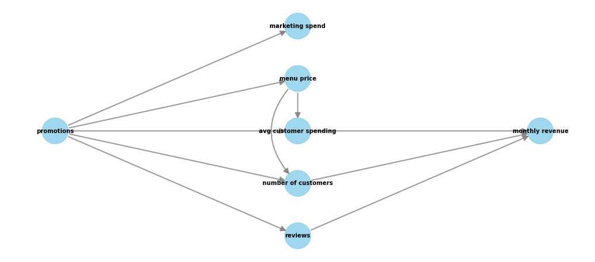

**Identifying and Estimating the Causal Effect**

Our analysis reveals that the number of customers significantly impacts monthly revenue, with smaller contributions from promotions and average customer spending. SHAP values highlight that the number of customers and marketing efforts are the most influential factors, while promotions have only a marginal effect.

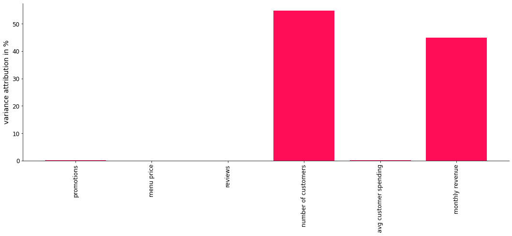

**Key Findings from SHAP and Causal Analysis**

1. Number of Customers: The most critical factor influencing monthly revenue. Increasing the customer base leads to a direct and substantial increase in revenue.
2. Marketing Efforts: Also plays a significant role in driving revenue by attracting more customers.
3. Promotions: Show a marginal contribution to revenue. While SHAP values indicate their importance, the causal analysis does not strongly attribute changes in revenue to promotions.
4. Average Customer Spending: Contributes to revenue but is less influential compared to the number of customers and marketing efforts.

**Insights and Hypotheses**

- Marginal Impact of Promotions: Despite their recognized importance in SHAP values, promotions do not show a strong causal effect on revenue in our current findings. This discrepancy suggests that promotions alone may not be sufficient to drive significant revenue increases.
- Location and Service Quality Hypothesis: The number of customers might depend heavily on the business location (e.g., being situated on an avenue or street with high foot traffic, having parking availability) and the quality of service offered. These factors can influence both the number of customers and the pricing of the menu.

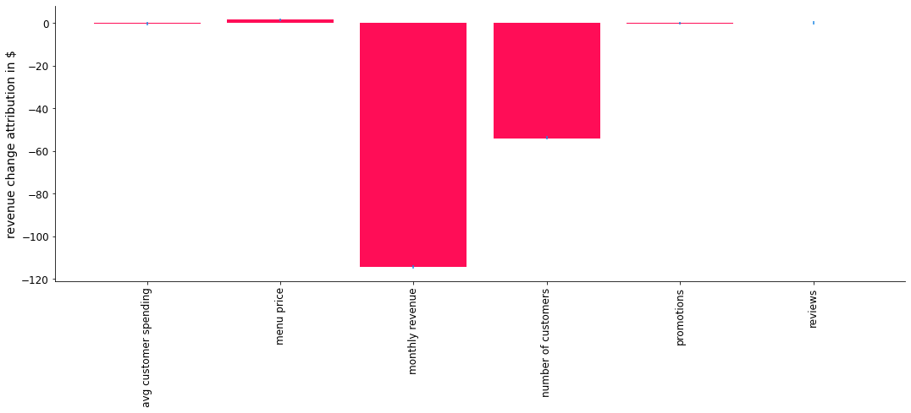

**Drafting a Strategy to Boost Revenue: Insights from Causal Analysis and Scenario Exploration**

After conducting our causal analysis, we determined that promotions do not have a significant causal effect on revenue for each site. With this understanding, we can now proceed with scenario exploration using DiCE (Diverse Counterfactual Explanations) to draft a comprehensive strategy aimed at boosting revenue.

*Key Focus: Increasing Revenue per Customer*

The results clearly indicate that to boost the average revenue of the sites, we must implement a combination of diverse strategies for each feature, with a key focus on increasing the revenue per customer. This approach will optimize the current situation and drive overall revenue growth.

**Scenario 0:**

The table below outlines the necessary changes to improve site revenue. Key highlights include:

- **Number of Customers**: Increase the average number of customers by 12 per site, representing a 28% growth.
- **Menu Price**: Implement a modest menu price increase of 1.4%.
- **Revenue per Customer**: The most significant challenge is raising the revenue per customer by 75%, which requires a substantial effort.

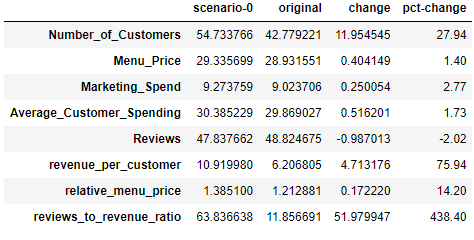

**Scenario 1:**

In Scenario 1, the analysis reveals the following key targets for revenue improvement:

- **Number of Customers:** Increase the average number of customers by 12 per site, representing a 28% growth.
- **Menu Price:** Implement a modest menu price increase of 2%.
- **Revenue per Customer:** The primary challenge is to boost revenue per customer by 92%, a substantial increase that requires strategic efforts.

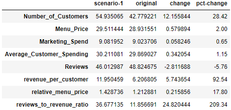

**Scenario 2:**

In the final scenario, we analyze the key features needed to boost site revenue:

- **Number of Customers:** Increase the number of customers by an average of 10 per site, representing a 24% growth. This is the lowest increment compared to previous scenarios.
- **Menu Price:** Implement a modest menu price increase of 0.84%, the lowest among the scenarios.
- **Revenue per Customer:** Increase revenue per customer by 90%, a substantial but slightly lower target than the previous scenario.
- **Marketing Spend:** Increase the average marketing spend by 5%, the highest increment compared to the other scenarios.

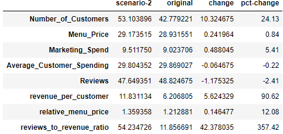

### Findings: Strategies to Boost Site Revenue

**Number of Customers**

Across all scenarios, we need to increase the number of customers by at least 24%. While this may seem like a significant increment, it can be achieved through gradual market development. Implementing targeted marketing campaigns, referral programs, and strategic partnerships can help attract new customers over time.

**Menu Price**

The necessary increase in menu price is modest, with the highest required increment being 2%. Without a clear understanding of market elasticity, we can conservatively raise prices by an average of 2%. This can be done by enhancing the perceived value of menu items through quality improvements and strategic menu redesign.

**Marketing Spend**

Increasing marketing spend by 5%, as suggested in the last scenario, appears realistic and is expected to significantly boost site revenue. Optimizing marketing strategies through ROI analysis, A/B testing, and data-driven campaigns will ensure that the increased budget is used effectively to attract and retain customers.

**Revenue per Customer**

To elevate sites from low to medium and medium to high revenue, we need to enhance the average revenue per customer by at least 75%. This substantial increase requires careful consideration of site-specific factors such as location, customer demographics, and spending behavior. Strategies like upselling, cross-selling, personalized marketing, and enhancing the overall customer experience will be crucial.

**Relative Menu Price**

This feature compares the menu price with the average customer spending. A value greater than 1 suggests a less price-sensitive clientele willing to pay more. To leverage this, we should aim to increase the perceived value by at least 14%, potentially through behavioral economics strategies like ending prices with 9 or 5. Highlighting premium offerings and ensuring high-quality service can also justify higher prices.

**Reviews to Revenue Ratio**

This metric examines the relationship between the number of reviews and monthly revenue. A high ratio may indicate that reviews significantly impact revenue, aiding in customer segmentation based on market response. However, our analysis shows no causal relationship between reviews and revenue. Therefore, for now, we can omit reviews, as all scenarios suggest reducing their emphasis.

### Strategic Implementation

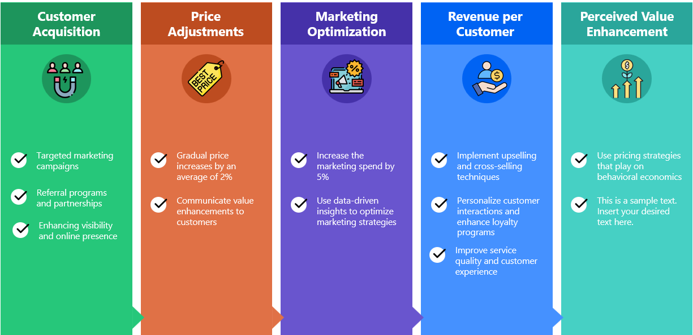
